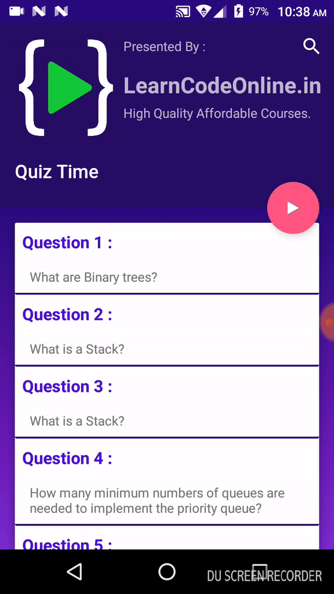
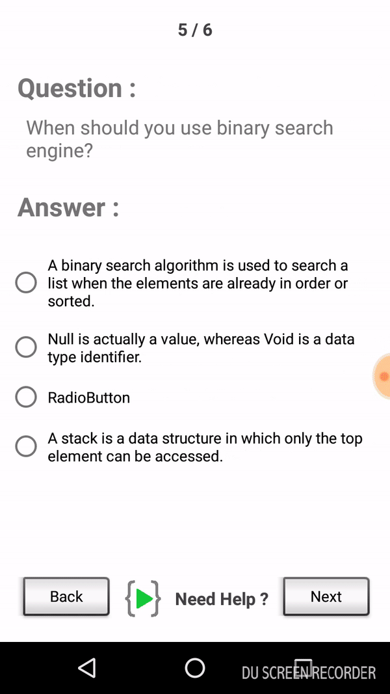
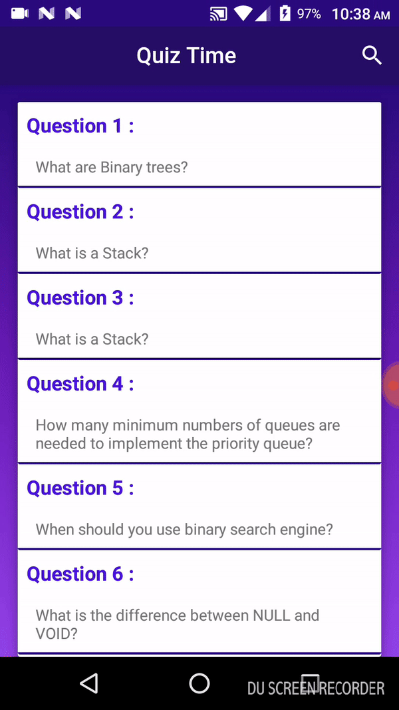

# AndroidQuizAPP
Android app whcih takes JSON input consisting of Questions & Answers from an API.

## Modes

1. Read (RecycleView questions & Viewpager question & answers)

2. MCQ test, 4 options for each question.

 Animated result acitvity for output for MCQ test.
 
 

## Features
Search specifc term and Read questions realted to those only.

Can take more data by chaning JSON data without changing format (Nothing is Static).

